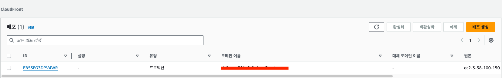

# Cloud Front
```properties
# ℹ️ AWS의 CDN (Content Delivery Network) 서비스다.
#   - CloudFront는 다른 CDN과 다르게 '정적' 콘텐츠와 '동적' 콘텐츠를 모두 처리한다.
```
## CND?
- Client 콘텐츠 요청 시 서버에서 받아온 콘텐츠를 캐싱하고 이후 같은 요청이 왔을 때 캐싱 데이터를 제공하는 서비스다.
  - 물리적으로 거리가 먼 곳에도 빠르게 요청을 처리할 수 있고 결과적으로 서버의 부하를 낮출 수 있다. 

## Edge Location(Pop) / Regional Edge Caceh(REC)


- Edge Location
  - CloudFront(CDN) 서비스가 콘텐츠를 캐싱하고 Client에게 제공하는 지점 혹은 캐시 서버를 의미
  - 사용자가 요청한 콘텐츠의 캐시가 `Edge Location`에 있다면 멀리 있는 서버에 직접 요청이 아닌 가까운 `Edge Location`에 저장된 캐시를 불러올 수 있다.
- Regional Edge Caceh
  - 사용자가 접근할 수 있는 글로벌 하게 배포되어 있는 CloudFront 위치이다.
  - 오리진과 Edge Location **사이에 위치**해 있다
  - CloudFront가 오리진에 요청하는 것을 줄여준다.
    - 쉽게 설명하면  Origin에 가기전에 한번 더 장기 저장되어 있는 캐시를 확인함  


## 동작 순서


- 사용자 요청
- 사용자에게 적합한 `Edge Location`로 라우팅
- `Edge Location`에서 캐시를 확인하고 있으면 이것을 사용자에게 반환
- 없으면 가장 가까운 `Regional Edge Caceh(REC)`로 캐시가 있는지 확인 요청
  - 없을 경우
    - `Origin`에게 요청
    - `Origin` > `Regional Edge Caceh(REC)` > `Edge Location` > `CloudFront`가 사용자에게 전달' 수순을 밟는다. (캐시도 추가된다)
  - 있을 경우
    - `Regional Edge Caceh(REC)`는 콘텐츠를 요청한 `Edge Location`으로 반환한다.
    - 캐시 저장

## HTTPS를 지원한다.
- `Origin`에서 추가적은 TLS 작업을 수행하지 않아도 HTTPS 적용이 가능하다 
  - 사용자 입장에서 CloudFront와 HTTPS 프로토콜 통신을 하고, 그 이후 `Origin` 과 서버는 HTTP 프로토콜로 통신하는 개념이다.

## Signed URL 기능
- CloudFront는 허용된 사용자에게만 접근할 수 있는 signed url 제공
  - 특정 구독 기능을 통해 사용자가 URL에 접근하는 것을 제한 할 수 있다.


## 간단 사용 예제
- EC2 인스턴스 생성
  - 인스턴스의 DNS 주소 복사
- CloudFront -> 배포 생성
- `Origin domain` 내 복사한 DNS 지정
- 뷰어 프로토콜 HTTP and HTTPS로 지정 
- 보안 설정
- 배포 생성
- 생성된 도메인으로 접속 시 `HTTPS` 접속 확인


