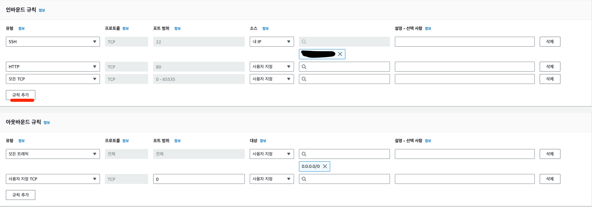

# EC2(Elastic Compute Cloud)
```properties
# ℹ️ 아마존 웹 서비스(AWS)에서 제공하는 클라우드 컴퓨팅 서비스이다
#  - 인터넷(클라우드)을 통해 서버, 스토리지, 데이터베이스 등의 컴퓨팅 서비스를 제공 하고
#      AWS에서 원격으로 제어할 수 있는 가상의 컴퓨터를 한 대 빌리는 개념
#   - 사용한 만큼 비용을 지불하기 때문에 탄력적인 이라는 의미의 Elastic이라는 단어가 붙어있다.
#      Elastic은 비용적인 부분 뿐만이 아니라 필요에 따라 성능, 용량을 자유롭게 조절할 수 있다는 의미도 가지고 있다
```

- 쉽게 말하면 Amazon에서 원격 PC를 빌리는 개념이다.
  - 고사양의 PC 및 운영체제가 설치되어 있는 상태의 PC(인스턴스)를 쉽게 생성 할 수 있다

## 가격 정책 
```properties
# ℹ️ 가격 정책 및 종류는 시간이 지나면 추가 및 제거가 될 수 있으니 필요할 떄마다 확인하자.
# - 제품 카테고리마다 다르며 Amazon EC2 요금에 대한 것만 기술함
``` 
- ### 프리티어
  - 1년간 조건부 무료이다
- ### 온 디맨드 인스턴스
  - 필요할때 마다 컴퓨터를 끄고 키고 해서 가격을 절약 할 수 있는 요금제이다.
    - 지역(region) 및 운영체제의 종류에 따라 가격이 달라진다.
  - 개발용으로 사용할떄는 가장 낮은 용도로 사용하면서 `on/off`시키면서 사용하면 저렴하게 이용이 가능하다.
    - `off` 시 요금 청구X
- ### 예약 인스턴스
  - 쉽게 생각하면 그냥 다달이 돈을 내는것보다 한방에 년간으로 구매허면 더욱 저렴하게 사용하는것이다.
  - 상황에 맞게 사용해주자 1년 사용 예약하고 사용 안하면 아깝다.
- ### 스팟 인스턴스
  - 쉽게 설명하면 주가랑 비슷하다 생각하자 사용하는 사람이 없으면 가격이 싸지고 많아지만 비싸진다. 
    - 실시간으로 가격이 유동적으로 바뀐다. 

## 인스턴스 설정 
- 만들어진 인스턴스의 설정을 변경 할 수  있다.
- 다양한 변경 방법이 있으며 필요에 따라 찾아 보고 설장하면 된다.
- 접근 방법
  - EC2 -> 인스턴스 -> 인스턴스 -> 원허는 인스턴스ID 클릭
    
    

## 보안 그룹
- 해당 인스턴스에 누가 접속 할지 어떠한 방법으로 접속할지를 설정이 가능하다.
  - 방화벽과 광장히 유사한 기능을한다.
- 인바운드, 아웃바운드 규칙 설정이 필요하다.
  - 규칙 추가를 이용하여 접근하는 방법을 추가할 수 있다.
    - 접속 프토토콜 유형, 포트 범위, 소스 및 설명
  - 잘못 된 설정을 하면 외부에서 접근이 불가능하니 조심하자.
    - 소스 설정을 `Anywahere`로 설정하면 지정한 프로토콜의 Type은 어디서든 접근이 가능함

      
 
  - 접근 방법
    - EC2 -> 왼쪽 네트워크 및 보안 -> 보안그룹

## 태그
- 해당 인스턴스의 정보를 태깅하는 것이다
  - 누가 관리하는지 타입이 뭔지 등등 해당 인스턴스의 원하는 정보를 간략하게 태그를 적을 수 있다.
- 접근 방법
  - EC2 -> 인스턴스 -> 지정 인스턴스 클릭 -> 하단 태그 관리

    


## 인스턴스 비밀번호 설정
- AWS는 제 3자에게 악용되면 엄청난 요금이 과징 될 수 있으므로 보안에 철저하다.
  - 키 페어 암호를 사용하면 인스턴스 자체에도 비밀번호를 걸어 사용이 가능하다.
    -  인스턴스 생성 및 네트워크 및 보안 탭에서 설정이 가능하다.
      
- 장점
  - 엄청나게 어려운 비밀번호로 인해 쉽게 해킹이 불가능하다.
- 단점
  - 파일 형식으로 저장되기애 탈취될 수 있는 가능성이 있다.

## 원격 제어
- 기본 적으로 인스턴스를 생성할 때 적용한 키 페어(`name.pem`)파일이 있어야 한다.
  - 또한 있더라도 `chmod 400`을 통해 접근 권한을 제어해 주자
- 연결 방법 - Linux 계열
  - 인스턴스 우 클릭
  - 연결을 누리면 사용 방법이 잘 작성 되어 있다.
    - Mac의 경우 `ssh`가 내장되어 바로 사용 가능
    
    
- 연결 방법 - Window
  - ⭐️ 주의 사항으로 RDP포트(`3389`) 인바운드 허용이 되어 있어야한다.
 
    

  - Microsoft에서 제공해주는 원격 제어 프로그램을 다운로드
  - 아마존에서 제공해준 `대상.rdp`파일을 실행 시키면 진행이 가능하다.
    - 비밀번호를 입력할 경우 웹사이트 내 나의 `pem`파일을 업로드하여 비밀번호로 변환 값 사용


## AMI    
- 내가 만들었던 인스턴스를 이미지화 하여 재사용하는 것이다.
  -  백업이나 Scale-Out 시 유용하다
- ### 이미지 생성 방법
  - 인스턴스 우 클릭
    - 이미지 및 템플릿
      - 이미지 생성
   

- ### 이미지로 인스턴스 생성 방법
  - 왼쪽 메뉴 이미지 클릭
    - AMI
      - 사용할 이미지 우 클릭
        - AMI로 인스턴스 시작
          - 이후 진행되는 부분은 인스턴스 생성과 크게 다르지 않으니 읽어보면서 진행
            
## AWS Marketplace
- 다양한 독립 소프트웨어 공급업체(ISV) 및 기타 타사 판매자의 소프트웨어, 데이터 및 서비스를 고객에게 제공하는 온라인 상점이다.
  - 고객이 AWS환경에서 소프트웨어 솔루션을 찾고 즉시 구입하여 사용할 수 있는 환경을 제공하는 AWS서비스이다
  - 쉽게 말하면 만들어 놓은 이미지(`AMI`)를 제공 및 판매하는 방식

- 장점
  - 시장에서 제공되는 다양한 소프트웨어 및 서비스를 쉽게 검색하고 비교할 수 있습니다.
  - 이미 토대가 만들어진 상태로 진행하기에 편리할 수 있다
- 단점
  - 최고의 단점은 직접 소프트웨어를 실행하는 것에 비해 인스턴스 생성 시 제한된 사용자 지정 옵션
  - EC2 인스턴스에서 직접 소프트웨어를 실행하는 것보다 가격이 더 높을 수 있습니다.
 
## Elastic IP(탄력적 IP) 할당
- 이슈   
  - 사용중이던 `Public IP, Public DNS`가 **변경** 된다.
    - 인스턴스를 정지 후 재시작해도 변경된다.
      - 이유 : Public Ip의 수는 제한 되어 있기 떄문이다.
- 해결 방법
  - `Elastic IPs`를 사용하면 된다.
    - AWS에서 탄력적 IP 주소를 할당 받는 개념이며 **유료이다**
- 사용 방법
  - 왼쪽 메뉴 네트워크 -> 탄력적 IP
  - 탄력적 IP 주소 할당
  - 생성된 IP를 원하는 인스턴스에 연결 

    


## Scale-Up
```properties
# 💬 Server 운용간 트래픽 증가로 인해 문제가 생길 수 있고 이에 가장 쉽게 해결 하는 방법은 Scale-Up이다.
#    다만 해당 방법은 비용이 비싸다는 단점이 있디.
```
- 흐름
  - 사용중인 인스턴스의 모니터링을 보고 문제점 파악
    - 해당 인스턴스 클릭 후 모니터링 탭 클릭

    

  - Scale Up 대상 인스턴스를 이미지(AMI) 생성
  - 해당 이미지를 부족한 부분의 사양을 설정 후 인스턴스를 생성
- 주의 사항
  - 기존에 사용하던 인스턴스 도메인과 새로 생성된 도메인 주소가 다르므로 해당 방법을 위에서 기술한 `Elastic IP(탄력적 IP)`로 해결해 주자
  - 기존 인스턴스를 `이미지 생성` 및 `Elastic IP(탄력적 IP)`로 인해 사용 중이던 인스턴스가 잠깐 멈출 수 있으니 주의하자
  - 많은 테스트와 시나리오를 통해 검증 후 실행 하자

## Scale-Out
```properties
# 💬 Scale-Up이 사용하는 서버의 사양을 늘리는 거라면 Out은 서버의 개수를 늘려 각각의 담당을 배정준다 생각하면 된다.
#    ㄴ> AWS는 ELB(Elastic Load Balancing)을 적용하여 로드 밸런싱을 처리한다.
```
 
  

## ELB(Elastic Load Balancing) - 로드 밸런싱
```properties
# 💬 수신 트래픽의 변화에 따라 자동으로 로드 밸런서 용량을 확장
#    ㄴ> 설정 몇 번으로 쉽게 적용이 가능하다.
#    ㄴ> Health Check 또한 쉽게 설정이 가능
# ℹ️ 보안 관련 접근(인바운드) 하려는 포트는 80 or 443만 적용해주면 된다.
#   ㄴ> SSH를 통해 들어가고 할 일이 없기 때문이다.
```
- 로드 밸런서 유형
  - Application Load Balancer 
    - HTTP 및 HTTPS 와 같은 Application 경우
  - Network Load Balancer
    - 초고성능, 대규모 TLS 오프로딩, 중앙 집중화된 인증서 배포, UDP에 대한 지원 및 고정 IP 주소가 필요한 경우
  - Gateway Load Balancer
    - GENEVE를 지원하는 서드 파티 가상 어플라이언스 플릿을 배포 및 관리해야 할 경우
- 주의사항
  - 로드밸런싱을 적용할 인스턴스 그룹을 만들어야 한다.
  - `Health Check`의 경우 인스턴스 그룹을 만들때 같이 설정 한다.
    - 상태 검사 -> 고급 상태 검사 설정
