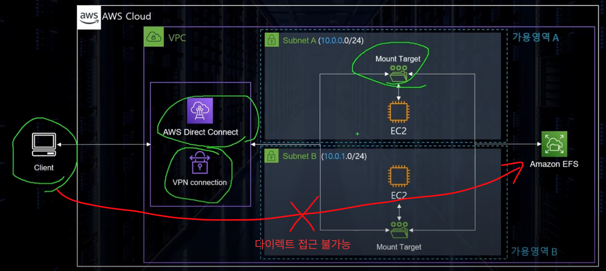
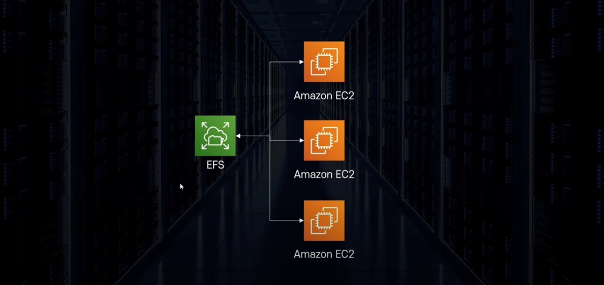
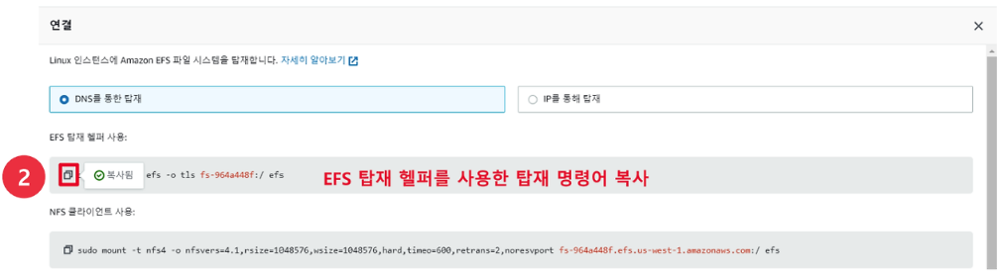

# EFS(Elastic File System)

```properties
# ℹ️ NFS 프로토콜 기반 공유 스토리지 서비스
# - 공유된 스토리지로 세션, 소스 코드, 빅데이터든 여러개의 EC2 인스턴스에서 공유된 스토리지가 필요할 경우 사용
```

## EFS란



- 따로 용량을 지정할 필요 없이 사용한 만큼 자동으로 증가
  - `EBS`는 미리 크기를 지정해서 만들어야함
- 몇 천개의 동시 접속 유지 가능
- 데이터는 여러 AZ(가용영역)에 나누어 분산 저장
- 쓰기 후 읽기 일관성
- ⭐️ `Private Service`이다. ( 외부에서 접근이 불가능 )
  - AWS 외부에서 접속 하기 위해서는 VPN 혹은 Direct Connect 등으로 별도 `VPC`와 연결이 필요하다.
- 각 가용영역에 Mount Target을 두고 각각의 가용영역에서 해당 Mount Target으로 접근한다.
- Linux 에서만 사용이 가능하다.
- ✨ 하나의 가용역역은 하나의 서브넷이다 ( 1:1 관계 )

## S3, EBS 차이점

- `EBS`
  - ✨ 외부에서 파일 접근이 **불가능**
  - 가상 하드 드라이브라고 생각하면 편하다.
  - 블록 스토리지 형태
- `S3`
  - ✨ 외부 파일 접근이 **가능**
  - 오브젝트 스토리지 형태
  - 웹 하드 와 같은 형태
  - 대규모 데이터를 저장하고 관리하기 위한 클라우드 스토리지
- `EFS`
  - ✨ 외부에서 파일 접근이 **불가능**
  - 공유 스토리지 서비스
  - 여러 인스턴스에서 접근할 수 있는 파일 스토리지로 개발, 테스트, 공유 파일 시스템에 사용.

## Fsx

- FSx for Windows File Server
  - EFS의 윈도우 버전
  - SMB 프로토콜을 사용
  - Linux, MacOS의 다른 OS에서도 사용이 가능하다.
- FSx for Lustre
  - 리눅스를 위한 고성능 병렬 스토리지 시스템
  - 주로 머신러닝, 빅데이터등의 고성능 컴퓨팅에 사용
  - 온프레미스에서도 엑세스가 가능함

## 예제

- 흐름

  - EFS에 연결된 3개의 인스턴스에서 회원 정보 공유

  

- ### 방법
  - EFS -> 파일 시스템 생성
    - VPC 설정을 해준다 ( EC2와 연결 할 것이니 같은 VPC로 사용해야 함 )
    - 지정된 가용영역 네트워크 보안그룹 설정
      - 기본 값으로 설정 되어있다. ✨ 변경 필수
      - NFS 유형의 TCP 프로토콜이 인바운드가 필수로 되어 있어야 한다.
  - 인스턴스 생성
    - 테스트에 맞게 3개의 인스턴스를 생성
      - 생성 후 EFS와 마운트 작업
        - EC2 내 `amazon-efs-utils` 패키지 설치가 필요하다.
        - 생성된 EFS -> 세부정보 보기 -> 연결
          - EFS를 연결할 수 있는 명령어 2개가 나온다 둘 중 아무거나 사용해도 문제 없다.
            
            
  - 자동 마운트 설정 (인스턴스가 재부팅 되어도 자동 마운트 함)
    - `sudo vim /etc/fstab`
    - `file-system-id:/ 'efs-mount-point' efs _netdev,tls 0 0`
      - \_netdev 옵션은 네트워크에 연결 후 마운트하라는 옵션이다.
