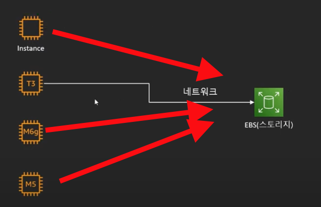
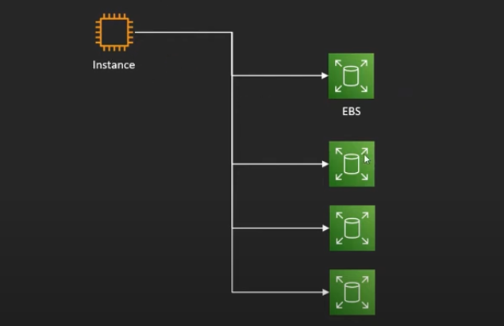

# EBS(Elastic Block Store)

```properties
# ℹ️ 가상의 "하드 드라이브"이다.
#   - EC2와 "네트워크"로 연결되어 있다.
#   ㄴ> 따라서 인스턴스가 종료 되어도 계속 유지가 가능
#   ㄴ> "네트워크"로 연결 되어 있기에 간단하게 EC2 사양을 Up/Down Grade가 가능
#      ㄴ> 내부 설치한 프로그램에 영향을 받지 않고 가능함
#   - 하나의 ESB를 여러 EC2에 장착 가능
#   - 루트 볼륨으로 사용 시 EC2가 종료되면 같이 삭제
#      ㄴ> 추가적인 설정으로 EBS만 따로 유지 가능
#   - EC2와 같은 "가용영역"에 존재
```

## EC2와 연결 구조 - 네트워크 연결 이점

- 사양을 편리하게 Up/Down Grade
  

- 편리하게 추가적으로 다른 `ESB`(가상 하드 드라이브)에 연결 또는 해제 가능
  

## Snapshot

- 특정 시간에 ESB상태의 저장본
  - 특정 시간의 EBS의 상태를 그대로 저장을 해놓는 것
- 필요 시 스냅샷을 통해 저장한 상태로 복구 가능
- 저장한 스냅샷은 `S3`에 보관
  - 증분식 백업
