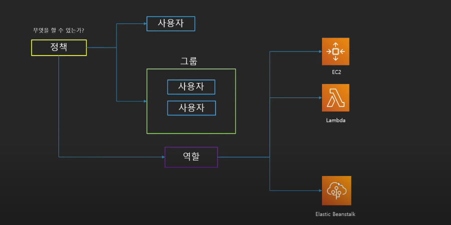
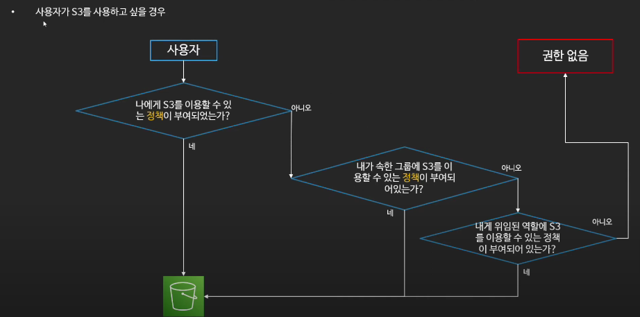
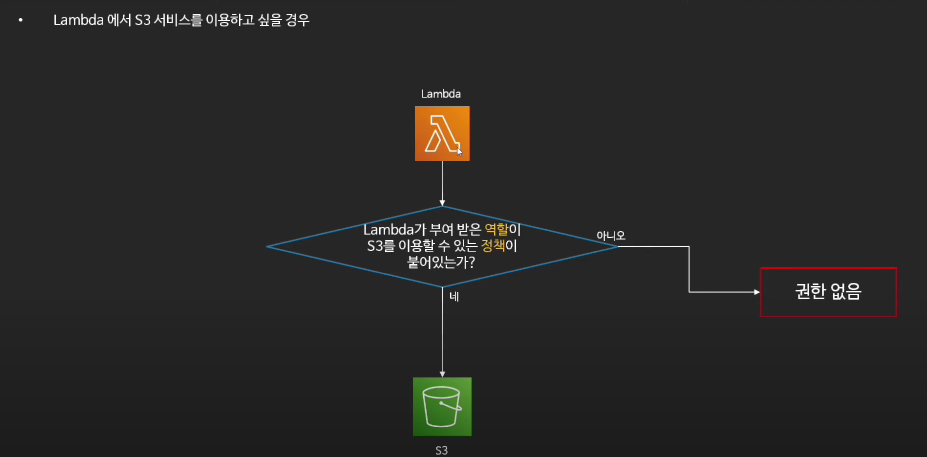

# IAM (Identity and Access Management)

```properties
# ℹ️ 중요 사항
# - 루트 사용자는 되도록 사용하지 말자
# - 불필요한 사용자 생성 하지 말자
# - 가능하면 그룹과 정책을 사용하자
# - 최소한의 권한만을 허용하는 습관을 들이자 (Principle of least privilege)
# - MFA를 활성화 하자
# - AccessKey 대신 역할을 활용하자
```

## IAM?
- 글로벌 서비스이다. 지역(`Region`)별 서비스가 아니다.
- AWS 어카운트 관리 및 리소스/사용자/서비스를 제어
    - 서비스 사용을 위한 인증 정보를 부여
- 사용자 생성 및 관리 계정의 보안
    - 사용자의 패스워드 정책 관리 또한 가능하다.
- 구성
    - 사용자
    - 그룹
        - 사용자의 집합
        - 그룹에 속한 사용자는 그룹에 부여된 권한을 행사 할 수 있다.
    - 정책(`Policy`)
        - 사용자와 그룹, 역할이 무엇을 할 수 있는지 작성해 놓은 문서
            - JSON 구조로 정의
    - 역할(`Role`)
        - AWS리소스에 부여하여 리소스가 무엇을 할 수 있을지 정의
            - Ex) EC2가 S3에 접근 할 수 있는 역할을 부여
        - 다른 사용자가 역항을 부여받아 사용
        - 역할을 바꾸어 가며 서비스 사용 가능

    

- 권한 검증 흐름
    - 사용자 경우

        

    - 리소스 경우

        

- 사용자 종류
    - 루트 사용자 : 결제 관리를 포함한 계정의 모든 권한을 가지고 있음
    - IAM 사용자 : `IAM`을 통해 생성해서 사용하는 사용자
        - 한 사람 혹은 리소스를 의미
        - 설정 시 콘솔 로그인 권한 부여 가능
        - 설정 시 AWS 서비스를 이용할 수 있음 (지정 권한 내)
            - Access Key
            - Secret Key
        - `AdminAccess` 권한을 부여하더라도 별도의 추가 설정을 하지 않으면 Billing 기능 사용 불가능

- 자격 증명 보고서
    - 계정의 모든 사용자의 정보를 나열하여 보고서를 생성하고 다운로드가 가능
    - AWS 콘솔, CLI, API에서 생성 및 다운로드가 가느앟ㅁ