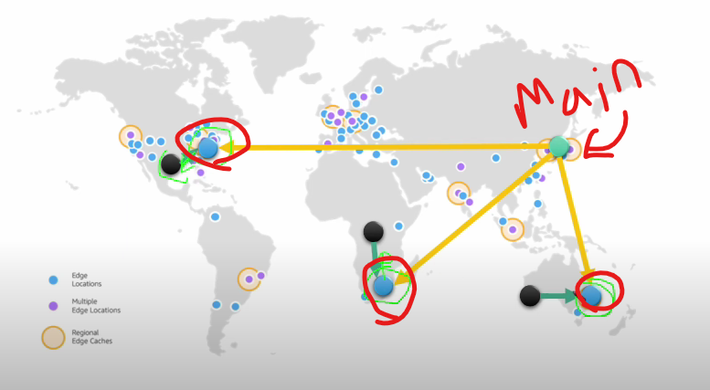

# awsStudy

### 가용구역(Avaliability Zone - AZ)

- AWS 서비스 중 만약 사용중인 서버에 문제가 생길 경우 같은 지역 내 다른 서버와 연결 되어있다.
  - 평범한 인터넷 망이 아닌 전용망을 통해 연결되어 있음 그렇기에 빠르게 데이터를 백업 받고 전달 할 수 있다.
- 서로 다른 지역(Region)에서는 내부적으로 서로 데이터를 주고 받을 수 없다 (인터넷을 통한 주고 받기는 가능하나 전용망을 사용 못한다는 개념임)
  - Ex) 도쿄 지역 -> 캘리포니아 지역 데이터를 주고 받을 수 없음

### ARN(Amazon Resource Name)

- AWS의 모든 리소스의 고유 아이디
- 와일드 카드(`*`)를 사용해서 다수의 리소스 지정 또한 가능하다.
