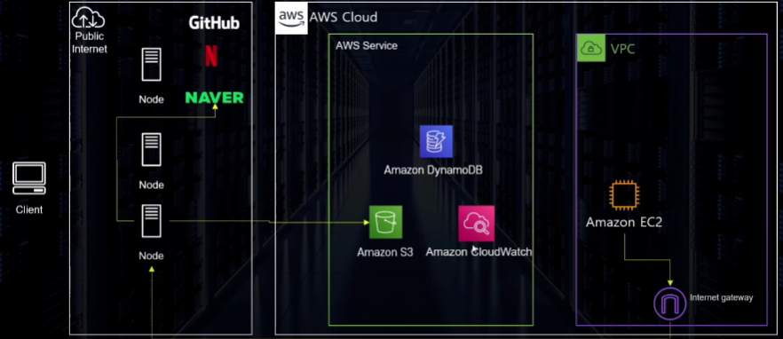
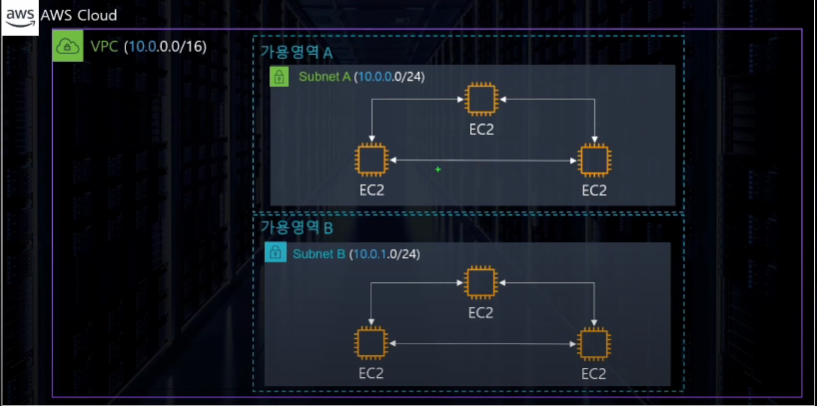
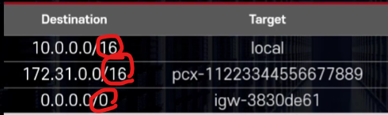
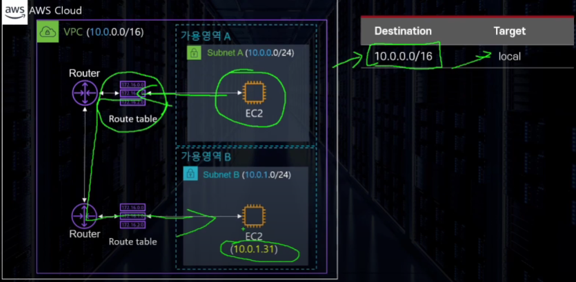
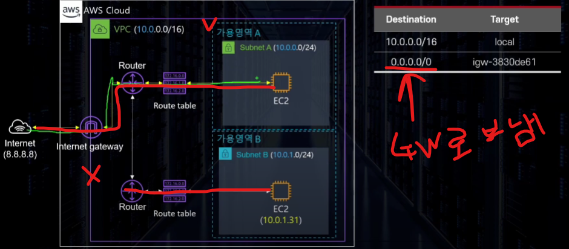

# VPC(Virtual Private Cloud)

- AWS 계정 전용 가상 네트워크 (가상의 데이터 센터)
    - 대부분의 리소스는 외부에서 접근이 가능하다 VPR는 원칙적으로 외부에서 접근이 불가능하다.
- AWS 클라우드에서 다른 가상 네트워크와 논리적으로 분리 되어 있다.
    - AWS 내부의 리소스끼리라도 VPC내에 있다면 직접적으로 연결이 불가능하다
        - `EC2`가 외부망에서 접근이 가능한 이유는 GateWay가 중간에 있기 때문이다.
- 외부에 격리된 너트워크 컨테이너 구성 가능( ℹ Docker 컨테이너가 아님 )
    - 원하는 대로 사설망 구축 가능
        - 부여된 IP대역을 분할하여 사용하는 방식
- 지역(`Region`)단위이다.
- 활용 방법
    - EC2, RDS, Lambda 등의 AWS 컴퓨팅 서비스 실행
    - 다양한 서브넷 구성
    - 보안 설정(외부에 노출되지 않는 EC2 구성)

## VPC 구성 요소
- 서브넷
- 인터넷 게이트웨이
- NACL/보안그룹
- 라우트 테이블
- NAT Instnace / NAT Gateway
- Bastion Host
- VPC Endpoint

### 서브넷(Subnet)

- VPC의 하위 단위로 VOC에 할당된 IP를 더 작은 단위로 분할한 개념
- 👍 하나의 서브넷은 하나의 가용영역(AZ)안에 위치한다.
- CIDR block range로 IP 주소를 지정
- 사용 가능한 IP개수
    - 👍 CIDR을 적용한 IP 주소에서 5개를 제외하고 계산
        - `x.x.x.0` :  네트워크 어드레스
        - `x.x.x.1` :  VPC Router
        - `x.x.x.2` :  DNS Server
        - `x.x.x.3` :  여분용
        - `x.x.x.255` :  브로트 케스트 어드레스 (단 브로드케스트를 지원하진 않음)
- #### 서브넷 종류
    - Public 서브넷 : 외부에 접근이 가능한 서브넷
        - 인터넷 게이트웨이(GW)를 통해 외부의 인터넷과 연결되어 있다.
        - 안에 위치한 인스턴스에게 `Public IP`부여 가능
        - 사용자에게 노출 되어야 하는 인프라에 적용
    - Private 서브넷 : 외부에서 인터넷을 통해 연결할 수 없는 서브넷
        - 외부에서 접근 가능한 방법이 없음
            - `Publid IP` 부여 불가능
        - DB, Service Logic Server 등 노출이 필요없는 인프라에 사용

### 라우트 테이블(Route Table)

- 트레픽이 어디로 가야할지 알려주는 이정표 역할
- VPC 생성 시 기본으로 하나 제공
- 매칭 순서
    - 1순위 Destination(목적지)에 맞는 IP
    - 2순위 2개 이상의 허용되는 범위가 있다면 가장 구체적인 주소
        - 구체적의 기준은 `CIDR`값이 가장 클 수록 구체적이라고 보면 된다.
    - 번외 : `0.0.0.0/0`은 모든 트레픽을 의미하기에 모든 목적에 맞으나 `CIDR`이 0이므로 구체적이지 않으므로 우선순위가 낮아짐
- 해당 Table을 사용하여 다른 가용영역(AZ)와 통신이 가능한 것이다.
    

### 인터넷 게이트웨이

- VPC가 **외부의 인터넷과 통신할 수 있도록** 경로를 만들어주는 리소스
- 기본적으로 확장성과 고가용성이 확보 되어있다.
- IPv4,6 지원
    - IPv4의 경우 NAT 역할
        - NAT(`Network Adress Translation`) : 사설IP <-> 공용 IP
- `Route Table`에서 경로 설정 후에 접근 가능
-  무료
