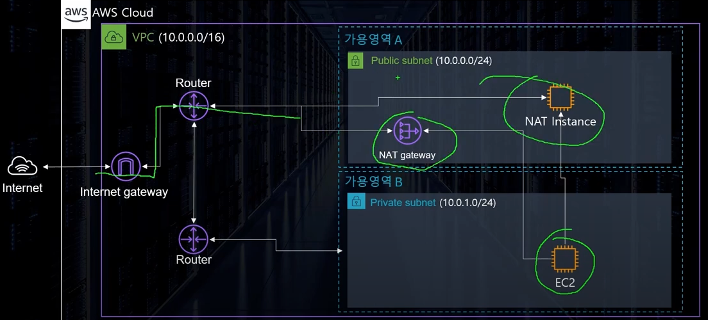
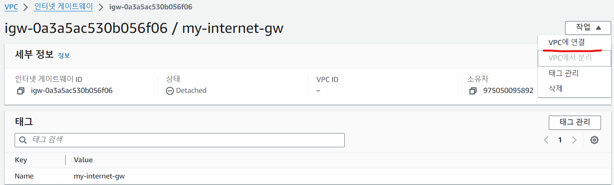

# VPC(Virtual Private Cloud)


- AWS 계정 전용 가상 네트워크 (가상의 데이터 센터)
  - 대부분의 리소스는 외부에서 접근이 가능하다 VPR는 원칙적으로 외부에서 접근이 불가능하다.
- AWS 클라우드에서 다른 가상 네트워크와 논리적으로 분리 되어 있다.
  - AWS 내부의 리소스끼리라도 VPC내에 있다면 직접적으로 연결이 불가능하다
    - `EC2`가 외부망에서 접근이 가능한 이유는 GateWay가 중간에 있기 때문이다.
- 외부에 격리된 너트워크 컨테이너 구성 가능( ℹ Docker 컨테이너가 아님 )
  - 원하는 대로 사설망 구축 가능
    - 부여된 IP대역을 분할하여 사용하는 방식
- 지역(`Region`)단위이다.
- 활용 방법
  - EC2, RDS, Lambda 등의 AWS 컴퓨팅 서비스 실행
  - 다양한 서브넷 구성
  - 보안 설정(외부에 노출되지 않는 EC2 구성)

## VPC 구성 요소

- 서브넷
- 인터넷 게이트웨이
- NACL/보안그룹
- 라우트 테이블
- NAT Instnace / NAT Gateway
- Bastion Host
- VPC Endpoint

### 서브넷(Subnet)


- VPC의 하위 단위로 VOC에 할당된 IP를 더 작은 단위로 분할한 개념
- 👍 하나의 서브넷은 하나의 가용영역(AZ)안에 위치한다.
- CIDR block range로 IP 주소를 지정
- 사용 가능한 IP개수
  - 👍 CIDR을 적용한 IP 주소에서 5개를 제외하고 계산
    - `x.x.x.0` : 네트워크 어드레스
    - `x.x.x.1` : VPC Router
    - `x.x.x.2` : DNS Server
    - `x.x.x.3` : 여분용
    - `x.x.x.255` : 브로트 케스트 어드레스 (단 브로드케스트를 지원하진 않음)
- #### 서브넷 종류
  - Public 서브넷 : 외부에 접근이 가능한 서브넷
    - 인터넷 게이트웨이(GW)를 통해 외부의 인터넷과 연결되어 있다.
    - 안에 위치한 인스턴스에게 `Public IP`부여 가능
    - 사용자에게 노출 되어야 하는 인프라에 적용
  - Private 서브넷 : 외부에서 인터넷을 통해 연결할 수 없는 서브넷
    - 외부에서 접근 가능한 방법이 없음
      - `Publid IP` 부여 불가능
    - DB, Service Logic Server 등 노출이 필요없는 인프라에 사용

### 라우트 테이블(Route Table)


- 트레픽이 어디로 가야할지 알려주는 이정표 역할
- VPC 생성 시 기본으로 하나 제공
- 매칭 순서
  - 1순위 Destination(목적지)에 맞는 IP
  - 2순위 2개 이상의 허용되는 범위가 있다면 가장 구체적인 주소
    - 구체적의 기준은 `CIDR`값이 가장 클 수록 구체적이라고 보면 된다.
  - 번외 : `0.0.0.0/0`은 모든 트레픽을 의미하기에 모든 목적에 맞으나 `CIDR`이 0이므로 구체적이지 않으므로 우선순위가 낮아짐
- 해당 Table을 사용하여 다른 가용영역(AZ)와 통신이 가능한 것이다.
  

### 인터넷 게이트웨이


- VPC가 **외부의 인터넷과 통신할 수 있도록** 경로를 만들어주는 리소스
- 기본적으로 확장성과 고가용성이 확보 되어있다.
- IPv4,6 지원
  - IPv4의 경우 NAT 역할
    - NAT(`Network Adress Translation`) : 사설IP <-> 공용 IP
- `Route Table`에서 경로 설정 후에 접근 가능
- 무료

### 보안 그룹(Security Group)


- NACL(Network Access Control List)과 함께 **방화벽**의 역할을 하는 서비스
- 기본적으로 모든 포트는 비활성화 처리 되어 있다.
- 선택적으로 트래픽이 지나갈 수 있는 Port와 Sorce를 설정 가능하다
- 포트를 `Deny` 설정이 불가능 하다
- 인스턴스 단위이다.
  - 하나의 인스턴스에 하나 이상의 Security Group 설정이 가능하다.
  - 설정된 인스턴스는 설정한 모든 Security Group의 룰을 적용한다.
  - 기본 5개 최대 16개 설정이 가능하다
- 상태 구조
  - Security Group : StageFul
    - `out bound allow : none`인 경우에도 들어온 트래픽이 허용이라면 Response 해준다
      
  - NACL : StateLess
    - ℹ️ `out bound allow` 설정이 없을 경우 응답이 불가능하다.
    - `in/out` 포트 설정을 해줘야 요청 및 응답이 가능하다
      

### 네트워크 ACL(NACL)


- Security Group과 같은 방화벽 역할을 해준다.
- 서브넷 단위이다.
- 포트 및 아이피를 직접 `Deny`가능하다
  - 외부 공격을 받는 상황등 특정 아이피를 막는 것이 가능하다.
- 순서대로 규칙 평가(평가가 낮은 순 **규칙 번호 순**)
  - 잘 못된 규칙 설정
    
  - 잘된 규칙 설정
    
  - NACL 규칙
    - 규칙 번호 : 규칙에 부여되는 고유 번호
      - AWS는 100단위 증가를 권장
    - 유형 : 미리 지정된 프로토콜, 선택 시 AWS에서 `Well Known Prot` 규칙 지정
    - 프로토콜 종류
    - 포트 범위
    - 소스 : IP 주소의 CIDR 블록
    - 👍 허용/거부 : `Security Group`차이점임 거부 설정이 가능함
- 상태 구조
  - NACL : StateLess
    - ℹ️ `out bound allow` 설정이 없을 경우 응답이 불가능하다.
    - `in/out` 포트 설정을 해줘야 요청 및 응답이 가능하다
      

### "NAT" Gateway



- VPC의 Private Subnet(폐쇄지역)에 있는 인스턴스에서 인터넷에 쉽게 연결 할 수 있도록 지원하는 가용성이 높은 AWS 괸리형 서비스이다.
- Private 인스턴스가 외부의 인터넷과 통신하기 위한 통로이다.
- `NAT Instance`는 단일 EC2 인스턴스이며 NAT Grateway 둘다 모두 서브넷 단위이다.

  - `Pulbic Subnet`에 있어야한다.

- `NAT Instance` 와 `NAT Gateway` 둘 다 Private한 공간에 있는 EC2를 대신해서 외부와 통신하여 데이터를 전송해주는 역할을 해준다.
  - **대신** 무언가를 전달하거나 진행해주는 역할을 해준다고 이해하면 쉽다

### 실습

- #### VPC 관련 정보

  - 커스텀 VPC 생성 시 만들어지는 리소스
    - 종류
      - 라우팅 테이블
      - 기본 NACL
      - 기본 보안그룹
    - 서브넷 생성 시 모두 기본 라우팅 테이블로 자동 연동
  - 서브넷 생성 시 AWS는 총 5개의 IP를 미리 점유한다.
  - `0~3,255`
  - VPC에는 단 하나의 Internet Gateway만 생성 가능하다.
  - Internet Gateway 생성 후 직접 VPC 연동이 필요하다.
  - Internet Gateway 는 **자체적으로** `고가용성/장애 내구성`을 확보
  - 보안 그룹은 VPC 단위이다.
  - 서브넷은 가용영역 단위와 같다 (서브넷 1개 == 가용영역 1개)
  - 가장 작은 서브넷 단위는 `CIDR : /24`(11개, 16-5)이다
  - 기본적으로 AWS는 각각의 지역(`Region`)마다 `VPC`와 `Subnet`이 기본적으로 생성 되어 있다.
    - Default VPC Name은 "-"로 되어 있고, CIDR는 `16`으로 되어 있다.
      

- #### 실습 내용

  - 커스텀 VPC 생성 (10.0.0.0/16)
  - 총 Subnet 3개 생성
    - Public 공간
    - Private 공간
    - DB 공간 (Private)
  - 각 Subnet에 각각 Routing Table 연동
  - Public Subnet에 인터넷 경로 구성 (`Internet Gateway` 연결)
  - `Public / Pirvat` Subnet에 EC2 생성
    - 각각 외부에서 접근 테스트
  - DB Subnet에는 Databse 생성
    - NAT Gateway Setup

- ##### VPC 생성

  - 처음 생성 시 "VPC만" 과 "VPC 등"으로 나뉜다. (실습에서는 "VPC만" 생성 사용)
    - "VPC만" : VPC만 생성
    - "VPC 등" : VPC와 함께 서브넷, 라우팅 테이블, 네트워크 연결 등을 한번에 만들 수 있다 (`Default 값`)
  - VPC명 과 IP를 지정하면 생성이 가능하다.
    
    - 테넌시는 대부분의 경우 "기본"으로 설정해서 사용이 가능하다.
    - VPC를 만들면 기본적으로 **라우팅 테이블**과 **보안(네트워크 ALC, 보안 그룹)**이 생성된다.
      - **라우팅 테이블**
        
      - **보안(네트워크 ALC, 보안 그룹)**
        

- ##### Subnet 생성

  ```properties
  # ℹ️ Public 과 Private을 나누는 기준이 되며, CIDR을 지정하는 IP범위 내로 지정한다.
  # 👉 Public의 경우 10.0.0.x 범위, Private의 경우  10.0.1.x, DB의 걍우 10.0.2.x 범위로 실습을 진행한다.
  ```

  

  - VPC 지정이 필수이며, 상위에서 만든 VPC를 적용해주자.
  - 가용 영역은 필수이며, 지정하지 않을 경우 AWS내에서 자동으로 지정한다.
  - 서브넷 CIDR 블록 지정이 필요한데 `/24, /32`와 같이 8로 나누는 것이 편하다
    - `1.0.0.x`의 애매하게 CIDR을 지정할 경우 범위에서 벗어나게 된다.
  - 지정 VPC내 서브넷의 `IP/CIDR`의 범위가 중복될 경우 자동으로 알려준다.
    

  - 서브넷 생성 시 자동으로 `네트워크ACL`과 `라우팅 테이블`을 연결해준다.
    - 전부 `Default` 상태로 연결 되어 있다.

- ##### 라우팅 테이블 연결

  - 기존에 `Default`로 설정된 라우팅 테이블을 각각에 맞는 라우팅 테이블을 만들어서 연결 해준다. (명시적 서브넷 연결을 해주는 것)
    - 기존의 것은 `Private 서브넷`에게 할당 해주자. (가시성을 위해 Name명을 변경해주자) - 라우팅 테이블 -> 저동 생성된 테이블 지정 -> 서브넷 연결
      
  - 남은 `Public 서브넷`과 `DB 서브넷` 또한 라우팅 테이블을 만들어 준다
    - VPC는 상위에 생성한 `my-vpc`를 사용
  - 각각의 모든 서브넷을 라우팅 테이블에 할당하여 명시적 연결이 없는 서브넷이 없게 해야한다

- ##### 인터넷 게이트웨이 연결

```properties
# ℹ️ 인터넷 연결이 필요한 서브넷은 게이트웨이를 연결해 줘야한다 (Public Subnet)
```

- 내용

  - 인터넷 게이트웨이 -> 인터넷 게이트웨이 생성 -> 이름 지정 -> 생성
  - 생성된 인터넷 게이트 웨이를 상위에 생성 했던 `my-VPC`에 연결해준다.
    - 기존에 있던 `Default VPC`가 선택 목록에 안뜨는 이유는 이미 다른 인터넷 게이트웨이와 연결 되어 있기 때문 - `VPC`는 **하나의 인터넷 게이트웨이**와 연결이 가능하다
      
  - 라우팅 테이블 편집을 통해 전달되는 `Ip` 대역대가 생성한 인턴넷 게이트 웨이를 타게 해준다.
    - 라우팅 테이블 -> 선택 -> 라우팅 -> 라우팅 편집
      
    - 라우팅 추가를 통해 `local`대역을 제외한 나머지 IP 대역을 인터넷 게이트웨이로 전달하게 설정
      

- ##### EC2 생성 VPC 연결
  - Public EC2
    - EC2 생성 후 네트워크 설정에서 "편집" 클릭 후 상단에 만든 VPC 변경
      
    - 네트워크 설정 부분 변경
      
      - VPC : 내가 만든 VPC
      - 서브넷 : `Public`으로 만든 서브넷
      - 퍼블릭 IP 자동 할당 : 활성화
        - 기본 값이 "비활성화"인 이유는 `Public Subnet`생성 시 설정을 해주지 않아서 이다.
          - `VPC -> 서브넷 -> 지정 -> 서브넷 편집`을 통해 수정이 가능하다.
      - 생성된 `EC2`에 연결하여 `curl -v 도메인`을 통해 외부와 연결을 확인한다.
        - 👎 해당 서브넷의 라우팅 테이블에 `Internet G/W`연결을 안해서 삽질함 .. 꼭 해주자
  - Private EC2
    - 상단과 과정은 똑같으나 서브넷 종류(`Private Subnet`)와 `퍼블릭 IP 자동 할당: 비활성화` 로 진행한다.
      - 비활성화 이유는 퍼블릭으로 접근할 일이 없기 떄문이다
    - 생성된 `EC2`에 연결하려 하면 연결이 불가능하다.
      - `Internet G/W`가 없기 때문이다.
        
      - 해당 실습에서는 `Bastion Host`을 사용해서 외부 접근이 가능한 EC2를 사용하여 접근한다
  - `Bastion Host` 활용 Private 연결
    - Public Subnet EC2 내 Private EC2의 `~.pem`파일 복사
      - 권한 변경이 필요하다 `chmod 400 대상`
    - 접근 하기 위한 `Private Subnet` IP 확인
    - ssh 명령어를 통해 접속
      - `ssh -i "{대상pem파일}" ec2-user@{{대상 IP}}`
  - DB EC2
    - `Private EC2`에 접근했던 방식과 똑같이 `Bastion Host`방식을 사용해서 접근한다.
      - 👉 해당 서브넷 또한 인터넷 GateWay와 연결이 되지 않은 Subnet이기 때문
    - 접근이 완료되면, `yum`을 사용해서 Database를 받으려 했지만 받을 수 없다. (위와 같은 이유)
    - `NAT 게이트웨이`를 생성하여 다른 EC2를 통해 외부망의 데이터를 받아 올 수 있다.
      - `VPC -> NAT 게이트웨이 -> NAT 게이트웨이 생성`
      - 해당 `NAT 게이트웨이`의 서브넷은 `Public Subnet`으로 지정해줘야한다.
        - 외부망에 접근을 해야하기에 당연하다
